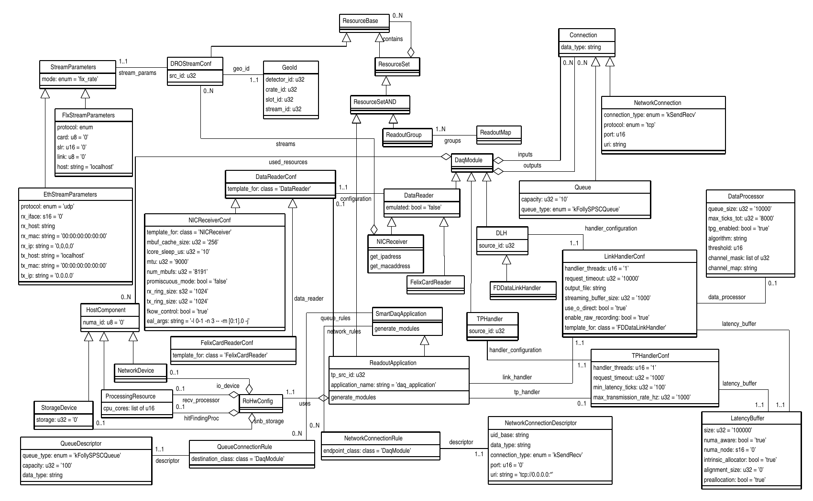
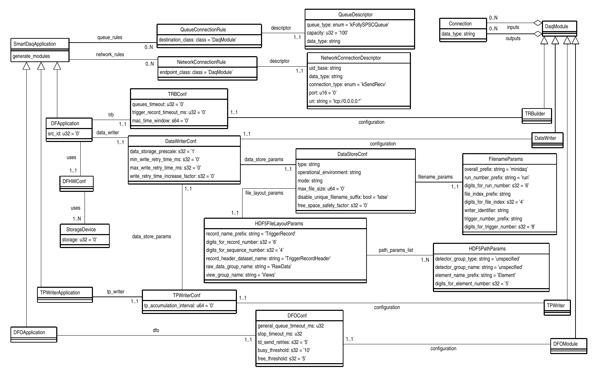

# Appdal 

 This package extends the schema from the coredal package
to describe readout, dataflow and trigger  applications.

  

## SmartDaqApplication

 **SmartDaqApplication** is an abstract class that has no direct
relationships with **DaqModules**. The **DaqModules** themselves must
be generated on the fly by an implementation of the
`generate_modules()` method. The **SmartDaqApplication** has
relationships to **QueueConnectionRules** and
**NetworkConnectionRules** to alow the `generate_modules()` method to
know how to connect the modules internally and to network endpoints.

*NB:* The declaration of the `generate_modules()` method must be
 repeated in each subclass and an implementation provided. The
 declaration in **SmartDaqApplication** is not pur virtual but its
 implemetation just throws a 'not implemented' exception.

## ReadoutApplication

 

 The **ReadoutApplication** inherits from both **SmartDaqApplication**
and **ResourceSetAND**. This means it has a contains relationship that
can contain any class inheriting from **RsourceBase** but should only
contain **ReadoutGroups**. The `generate_modules()` method will
generate a **DataReader** and set of **DataLinkHandlers** for each
**ReadoutGroup** plus a single **TPHandler**. The modules are created
accoriding to the configuration given by the data_reader, link_handler
and tp_handler relationships respectively. Connections between pairs
of modules are configured according to the queue_rules relationship
inherited from **SmartDaqApplication**.

### NICReader

 The **NICReader**, which is generated on the fly by the
**ReadoutApplication**'s `generate_modules()`, has a relationship to a
**NICReceiverConf** which will be the same for all **NICReceivers** of
the **ReadoutApplication** and maybe for all the
**ReadoutApplications** in the **Session**. Its only distinguishing
configuration item is the relationship it has to a **DROStreamConf**.

## Notes/Queries

The **EthStreamParameters** and the **FlxStreamParameters** classes
both contain host addresses. It is not clear how these relate to the
**VirtualHost**/**PhysicalHost** classes from the core schema.

## DataFlow applications

  

The Datflow applications, which are also **SmartDaqApplication** which
generate **DaqModules** on the fly, are also included here.