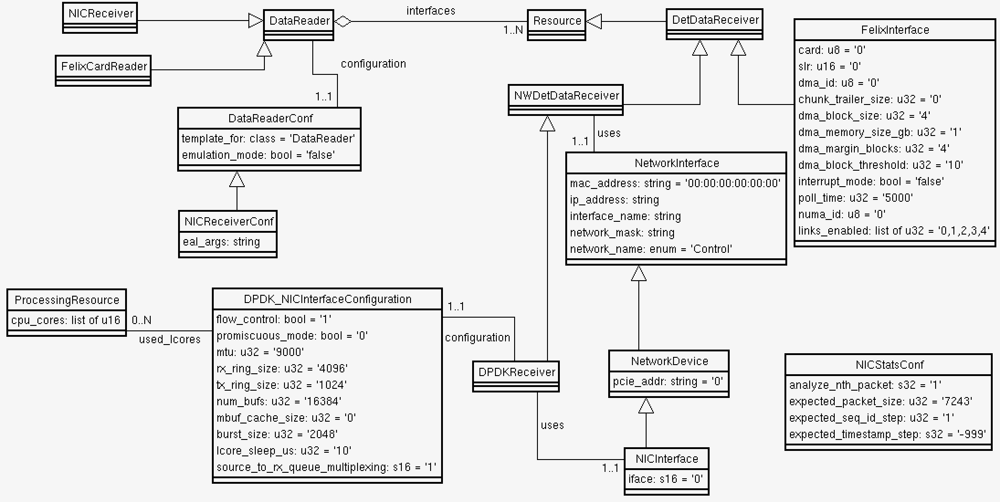

# Appmodel 

 This package extends the schema from the confmodel package
to describe readout, dataflow and trigger  applications.

## SmartDaqApplication


 **SmartDaqApplication** is an abstract class that has no direct
relationships with **DaqModules**. The **DaqModules** themselves must
be generated on the fly by an implementation of the
`generate_modules()` method. The **SmartDaqApplication** has
relationships to **QueueConnectionRules** and
**NetworkConnectionRules** to alow the `generate_modules()` method to
know how to connect the modules internally and to network endpoints.

*NB:* The declaration of the `generate_modules()` method must be
 repeated in each subclass and an implementation provided. The
 declaration in **SmartDaqApplication** is not pure virtual but its
 implemetation calls the generate_modules() implementation of the
 specific subclass using a 'magic' map of class names to generate functions.

Readout, HSI, Hermes andDataflow and Trigger applications extend from **SmartDaqApplication**
## ReadoutApplication

 

 The **ReadoutApplication** inherits from both **SmartDaqApplication**
and **ResourceSetAND**. This means it has a contains relationship that
can contain any class inheriting from **ResourceBase** but should only
contain **DetectorToDaqConnection**s. The `generate_modules()` method will
generate a **DataReaderModule** for each **DetectorToDaqConnection** associated with the application, and set of **DataHandlerModule** objects, i.e. **DLH** for each
**DetectorStream** plus a single **TPHandlerModule** (FIXME: this shall become a TPHandler per detector plane). Optionally **DataRecorderModule** modules may be created (not supported yet)). The modules are created
according to the configuration given by the data_reader, link_handler, data_recorder
and tp_handler relationships respectively. Connections between pairs
of modules are configured according to the queue_rules relationship
inherited from **SmartDaqApplication**.

### Far Detector schema extensions



Several OKS classes have far detector specific customisations, as shown in the diagram.

## DataFlow applications

  

The Datflow applications, which are also **SmartDaqApplication** which
generate **DaqModules** on the fly, are also included here.

## Trigger applications

  

The Trigger applications, which are also **SmartDaqApplication** which
generate **DaqModules** on the fly, are also included here.

## WIEC application

  

The WIEC application is a **SmartDaqApplication** which generates **HermesModule** modules , and in future WIB modules, on the fly.
It extends from **ResourceSetAND** and contains **DetectorToDaqConnection**s, which each contains a **DetDataReceiver** and **DetDataSender**s containing **DetectorSrteam**s.

## Testing SmartDaqApplication module generation

This package also provides a program `generate_modules_test` for
testing the generate_modules method of SmartDaqApplications. It reads
a configuration from an OKS database, generates the DaqModules for the
requested SmartDaqApplication and prints a summary of the DaqModules
and Connections.

## Creating A Diagram of Your Configuration

In `appmodel` it's possible to create a diagram of a DAQ configuration in the [DOT graph description language](https://en.wikipedia.org/wiki/DOT_(graph_description_language)), which can then be fed to the `dot` program to generate a viewable graphic. This is accomplished using the `create_config_plot` application. You can run `create_config_plot -h` to see how it's used, but to explain it simply, you provide it with a database file and the name of a session, segment or application in the database, and it will create a plot using that object as the root of the plot. E.g., with the `appmodel` repo you can generate a plot of its entire test DAQ session via:
```
create_config_plot -f $APPMODEL_SHARE/test/config/test-session.data.xml -r test-session
```
and if you want to plot the `mlt` application in there, you can just do
```
create_config_plot -f $APPMODEL_SHARE/test/config/test-session.data.xml -r mlt
```
Either of these commands will create (or clobber) a file called `config.dot`. If you wish to give the file a different name you can use the `-o` option, e.g., `-o mypreferredname.dot`. Once you have the DOT file, you can generate a graphic by doing the following:
```
dot -Tsvg -o mypreferredname.svg config.dot
``` 
...which can then be displayed, e.g., in a browser window via the link `file:///path/to/file/mypreferredname.svg`.

Note that while `dot` is available on the np04 cluster, it's not currently part of our externals; if `dot` isn't available on your host, you'll want to use Spack to install the Graphviz package which contains `dot` via `spack install --reuse graphviz +expat` and then `spack load graphviz`. The installation process will take a few minutes. Remember that in order to set up a work area which allows you to install Spack packages [you need to pass `-s` to `dbt-create`](https://dune-daq-sw.readthedocs.io/en/latest/packages/daq-release/Build-external-packages-with-spack-in-a-work-area/). Also note that in this scenario after you're done using `dot` that if you wish to develop code you'll want to `spack unload graphviz`; more generally, your build environment isn't guaranteed to continue working after you run `spack load <package>`.

